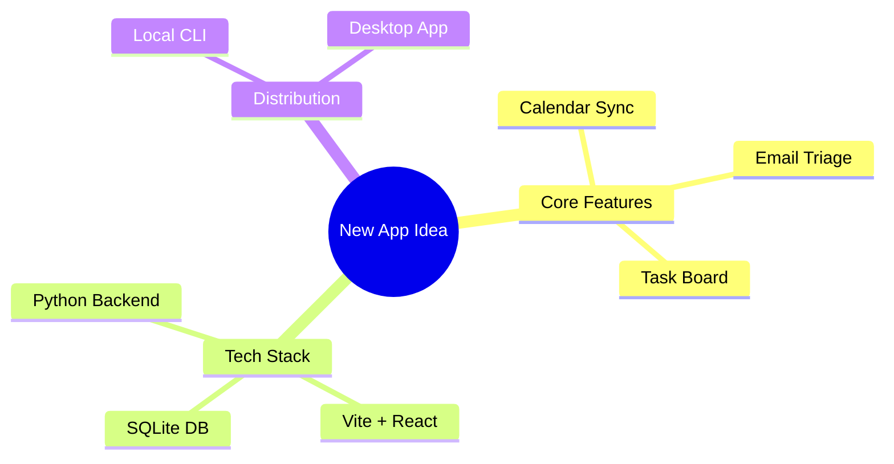

# Brainstorming & Creative Ideation Skill

Use this skill when the user wants to brainstorm new features, solve complex open-ended problems, generate creative content, or explore multiple design alternatives.

---

## 1. Ideation Frameworks

When tasked with brainstorming, choose and apply one or more of these structured frameworks:

### SCAMPER Framework
- **Substitute**: What materials, steps, or people can we swap out?
- **Combine**: What unrelated concepts or features can we merge?
- **Adapt**: What existing solutions from other domains can we adapt?
- **Modify/Magnify**: What can we exaggerate, simplify, or emphasize?
- **Put to another use**: How can this solve a completely different problem?
- **Eliminate**: What is redundant and can be removed for simplicity?
- **Reverse**: What if we do the exact opposite of the current approach?

### Lateral Thinking & First-Principles
- Deconstruct the problem down to its most basic, undeniable truths.
- Challenge all baseline assumptions (e.g. "We must use SQL" -> "Why? What if we used a flat file or local memory?").
- Think outside standard industry patterns.

---

## 2. Interactive Mind-Mapping

Always structure output visually using **Mermaid Diagrams** or clean **Markdown Tables** to represent ideas.

### Example Mermaid Mindmap

---

## 3. Collaborative Ideation Loop

*   **Do not overwhelm the user**: Present 3-5 distinct, high-quality ideas at a time instead of a giant list of 20 low-quality options.
*   **Encourage feedback**: End your turn by asking the user which direction they prefer (e.g., "Would you prefer a lightweight CLI utility, a full-featured web app, or an automated cron script?").
*   **Refine iteratively**: Once the user chooses a direction, zoom in on that choice and flesh out the specific implementation steps.

---

## 4. Action Plan Generation

Once the brainstorm settles on a solution:
1.  Summarize the chosen concept.
2.  Break it down into an **Action Plan** (Markdown task list).
3.  Propose writing a prototype file to start executing the plan.
